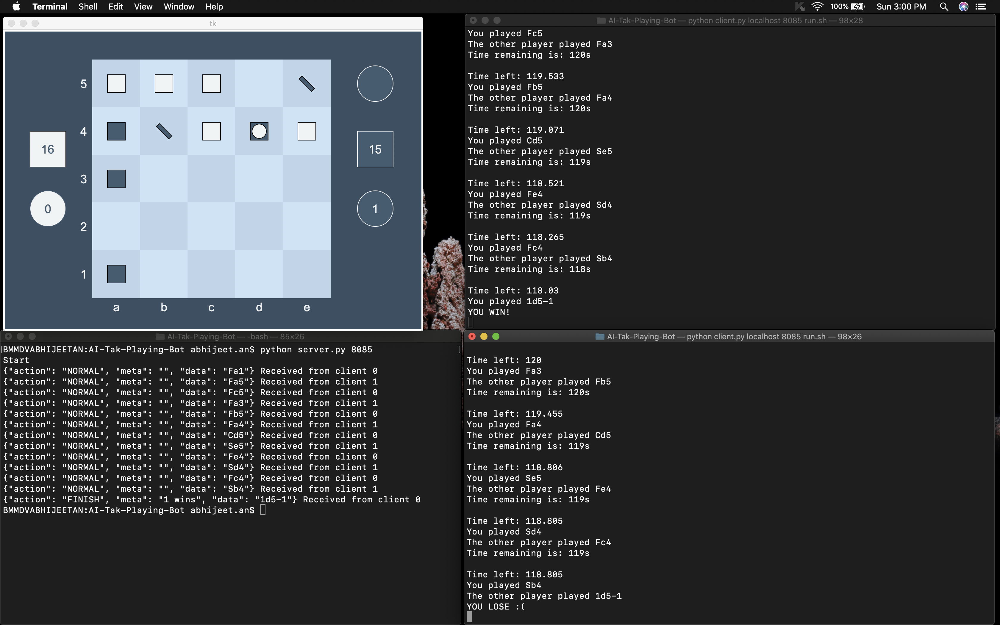

# AI-Tak-Playing-Bot

Goal: Create a Tak playing bot using adversarial search algorithms (minimax and alpha beta pruning), which arise in sequential, deterministic, adversarial situations.

<b>Description Tak(n)</b>: The game of Tak is played between 2 players (black and white) on an nxn board with the objective of creating a road, which is a line of your own pieces connecting two
opposite sides of the board.  
Each square of the board can contain one or more pieces forming a stack,
and each square along the road you build must have a 
atstone or capstone of your color on top. The
5x5 version of the game typically has 21 
atstones and 1 capstone per player.    To read the full rules
of the game, visit http://cheapass.com/sites/default/files/TakBetaRules3-10-16.pdf and
watch the video at http://cheapass.com/tak/ to get an idea of the gameplay.

<b>Interaction with Game Server: </b> 
<b>Running the server:</b> The server is run using the command:
python server.py <port no.> <no. of clients>
 
<b>Running the client:</b> The client is run using the command:
python client.py <server ip> <port no.> <executable>
 
The executable must be a bash script which runs your code.
 
<b>Sending moves to the server:</b>
You must write your move to stdout as a string (described below) followed by a '\n'. Similarly you
can read the move of your opponent from stdin. Note: You can write debugging/error messages
to stderr. Do not write anything except your move to stdout.

Tak has two types of moves, either placing a stone on the board or moving a stack. A square
on the board is specified by a lowercase letter (starting from a) followed by a digit (starting from1) as in chess.

1. <b>If you are placing a stone,</b> first you need to specify what kind of stone you are placing. This
is specified by the letter F, S or C, indicating 
at stone, wall (standing stone), or capstone
respectively. This is followed by the square on which stone is being placed. Eg:
(a) Place a 
at stone on the square a1 : Fa1
(b) Place a wall at d3 : Sd3
(c) Place a capstone at b4 : Cb4
 

2. <b>If you are moving a stack on the board</b>, first you need to specify the number of stones being
moved from a stack (eg. 4). Then you specify the square from which the stack is being moved
(eg. c3). Then you need to specify the direction in which the stones picked will move. This
is specified by one of the following symbols: < (moving towards the letter a on board), > (the
opposite direction), - (moving towards the number 1 on board) or + (the opposite direction).
Finally you specify the number of stones to drop on each square in the given direction. Eg:
(a) Move a single stone from a1 to b1 : 1a1>1
(b) Move 4 stones from d3 to d2 : 4d3-4
(c) Move 4 stones from b2, dropping two on b3, one on b4 and one on b5 : 3b2+211
(d) Move 5 stones from e4, dropping two on d4 and three on c4 : 5e4<23

